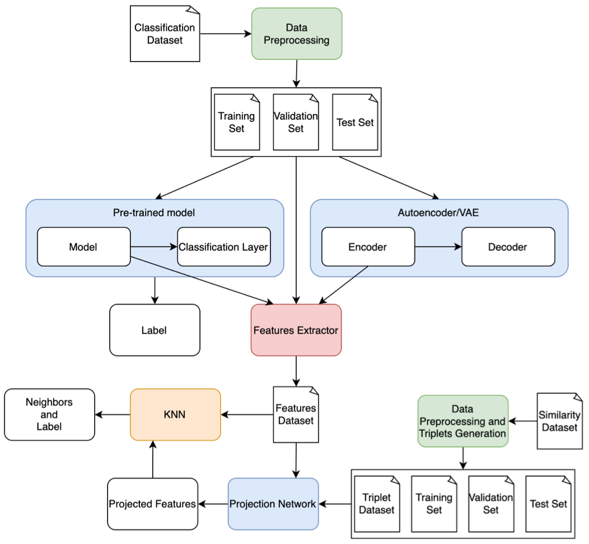

# **Oral2**
This project utilizes pre-trained classification models to tackle the classification of oral cancers into categories such as traumatic, apthous, and neoplastic. Features are extracted from these classification models as well as from autoencoders. Subsequently, these features are projected onto a multi-dimensional space using a projection network, aiming to construct a new space where similar images are positioned closely together. By leveraging Case-Based Reasoning (CBR) and informed deep learning, along with an additional similarity dataset, the project aims to generate explanations. These explanations are then evaluated using metrics such as the Jaccard distance, Kendall Tau distance, and Spearman Footrule distance.

## Goals are:
- To perform oral cancers classification;
- To extract an project features in multi-dimensional spaces;
- To model multi-dimensional spaces for explain performed classifications.

## Preview
<p align="center">
   
</p>

## Install

Create the virtualenv (you can also use conda) and install the dependencies of *requirements.txt*

```
python -m venv env
env/Scripts/activate
python -m pip install -r requirements.txt
mkdir data
```
Then you can download the oral coco-dataset (both images and json file). Copy them into `data` folder and unzip the file `oral1.zip`.

## Usage
Regarding the usage of this repo, in order to reproduce the experiments, we organize the workflow in two part: (i) data preparation and (ii) deep learning experiments.

### Data preparation
Network for classification:
Due to the possibility of errors in the dataset, such as missing images, run the check-dataset.py script to detect such errors. Returns the elements to be removed from the json file (this can be done manually or via a script).
```
python -m scripts.check-dataset --dataset data\coco_dataset.json
```
In this work, the dataset was annotated with more labels than necessary. Some are grouped under more general labels. To aggregate all the labels of the three diseases studied in this work, the following script is executed. In addition, we split the dataset with the holdout method.
```
python -m scripts.simplify-dataset --folder data
python -m scripts.split-dataset --folder data
```

You can use the `dataset-stats.py`   script to print the class occurrences for each dataset.
```
python -m scripts.dataset-stats --dataset data\dataset.json # entire dataset
python -m scripts.dataset-stats --dataset data\train.json # training set
python -m scripts.dataset-stats --dataset data\test.json # test set
```

Network for projection:
When executing the preprocess-ranked-dataset.py script, the following tasks are performed:
- Dataset cleaning involves removing all empty entries and filling any blank spaces or incorrect ranks with -1.
- Generation of a triplet dataset comprising an anchor, a case nearer to the anchor than the second case, and a second case.
- Identification and highlighting of entries with images not present in the dataset.
```
python -m scripts.preprocess-ranked-dataset
```

Executing the check-ranked-dataset.py script reveals the following information:
- Detection of missing images within the ranking rows.
- Identification of missing anchor images in the ranking.
- Detection of errors such as duplicated ranks and missing ranks for images.
- Determination of the maximum rank for each image.
```
python -m scripts.check-ranked-dataset --original_dataset data/dataset.json --ranking data/ranking.csv 
```

Split the triplet dataset generated from the ranking:
```
python -m scripts.split-ranking.py --dataset data/oral_ranked_dataset.csv --directory triplet
```


### DL experiments

## Classification model
```
python classifier-train.py
```

## Projection model
```
python triplet-train.py
```

# Example of a simple pipeline
- Classification models
  - Set the classification parameters from the configuration file
  - ```python classifier-train.py```
  - Set the `features_extractor.checkpoint_path` in the projection configuration as the model for feature extraction.
  - Set the `features_extractor.classifier=True` in the projection configuration in order to activate the feature extractor for the classifer features.
  - ```python scripts.features-extractor```
- Autoencoders models
  - Set the autoencoders parameters from the configuration file
  - ```python image-autoencoder-train.py``` or ```python image-vae-train.py```
  - Set the `features_extractor.checkpoint_path` in the projection configuration as the model for feature extraction.
  - Set the `features_extractor.vae=False` in the autoencoders configuration in order to activate the feature extractor for the autoencoder features.
  - Set the `features_extractor.vae=True` in the autoencoders configuration in order to activate the feature extractor for the vae features.
  - ```python scripts.features-extractor-autoencoder```
- (```python plot-pca.py```)
- Set the `triplet.projection=False` in order disable projection.
- ```python rank-projection.py```
- Set the projection parameters from the configuration file
- ```python triplet-train.py```
- Set the `triplet.checkpoint_path` in the projection configuration as the projection model to use.
- Set the `triplet.projection=True` in order to activate projection.
- ```python rank-projection.py```
- Set the `features_extractor.classifier=False` in the projection configuration in order to activate the feature extractor for the projected features.
- ```python scripts.features-extractor```
- (```python plot-pca.py```)


Inspect logged data during training processes:
```
python -m tensorboard.main --logdir=logs
```


